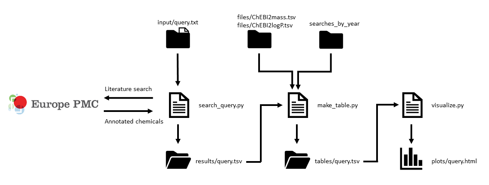

# Toolbox
This toolbox contains python scripts that follow the [EuropePMC2ChEBI KNIME workflow](https://github.com/magnuspalmblad/EuropePMC2ChEBI). In this workflow, annotated chemicals are collected through literature searches via the [Europe PMC site](https://europepmc.org/). Properties of these chemicals can be visualized in interactive plots using the [Bokeh library](https://bokeh.pydata.org). This allows comparison between the data of different query searches, for example detecting bias in different analytical chemical techniques.

# Workflow

# Using external sources to get plot properties
In the 'files' folder, files can be found with ChEBI identifiers linked to a certain property. These do not come from the search itself but can be looked up in the ChEBI Ontology. Additionally, logP and logS values are predicted using the AlogPS3.0 model from the OCHEM website [ochem.eu site](https://ochem.eu). By executing update_chebis.py, all these properties are gathered and stored in sperate files in the 'files' folder.

# What's in the Toolbox
 ## Folders
 The toolbox has five folders:

- In the 'files' folder should contain the .tsv files that link [ChEBI](https://www.ebi.ac.uk/chebi/) identifiers to properties e.g. names, mass, chemical structure. It also contains (the latest) ChEBI ontology, and the ontology version number used to create the ChEBI files stored in a text file ('ontology_version.txt').

- In the 'queries' folder, text files with the query terms should be stored. Synonyms of a query should be added on the same line, each separated by a comma. Multiple queries can be added on new lines.

- In the 'metadata' folder, metadata from a query search is stored in a text file. This contains information such as the query, search date, amount of publications etc.

- In the 'results' folder, annotated chemicals that have been extracted from the literature search are stored with their ChEBI identifier plus the publication id of the paper in which it was found.

- The 'tables' folder contains files for every query search, in which tables are created with the ChEBI identifier, the amount of hits in the search, names, and other properties.

- The 'plots' folder contains the html files of the interactive plots. Mass is shown on the y-axis and logP is shown on the x-axis.
 The color intensity is log scaled.
 
 - In the 'searches_by_year' folder, data of all publications per year can be found. This data is used to perform tfidf normalization. Not on this repository, might be added later (2019/12/11)
 
## Scripts
In the toolbox are python scripts for the "query search to visualization" workflow, but also scripts that make/update files that are used for visualization (see run only once scripts).

### search_query.py
This script takes query searches in a text file from the 'queries' folder as input, extracts all the chemical annotations in the papers found with this query on the Europe PMC site, and pust the results in a .tsv file in the 'results' folder.

### make_table.py
This scripts takes the results from the 'results' folder as input, as well as the ChEBI files in the 'files' folder, and makes a table for every chemical containing its ID, count, mass, etc. This table is stored as a .tsv file in the 'tables' folder. Additionally, counts from the chemicals are normalized with [term frequency inversed document frequency](https://en.wikipedia.org/wiki/Tf%E2%80%93idf), using the data in the 'searches_by_year' folder.

### visualize_query.py
This script takes a table from the 'tables' folder as an input. These counts are then shown in interactive hexabin plots with mass on y-axis and logP on x-axis using the Bokeh Library.

## Run only once (per month) script
The following need only be run at most once a month, as this is the current (February 2020) update frequency of the ChEBI ontology itself.

### update_chebis_test.py
This script checks the [latest ChEBI ontology](ftp://ftp.ebi.ac.uk/pub/databases/chebi/ontology/) version and compares its version number to the version number in the 'ontology_version.txt' file in the 'files' folder.
If the version is not up-to-date, new chemicals from the ontology are added with their properties to the ChEBI files in the 'files' folder, and the version number of 'ontology_version.txt' is changed. Predicted values (logP and logS) are retrieved by using the AlogPS3.0 model. This model predicts logP and logS from SMILES. These SMILES are passed through the OCHEM REST-like web service.

